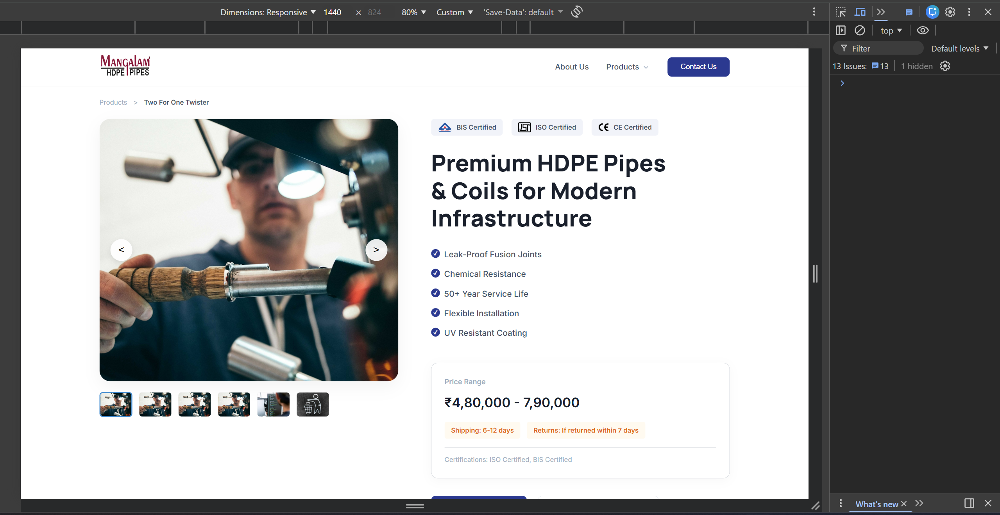
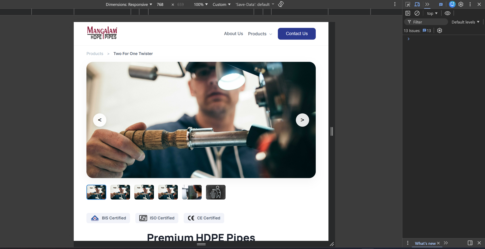
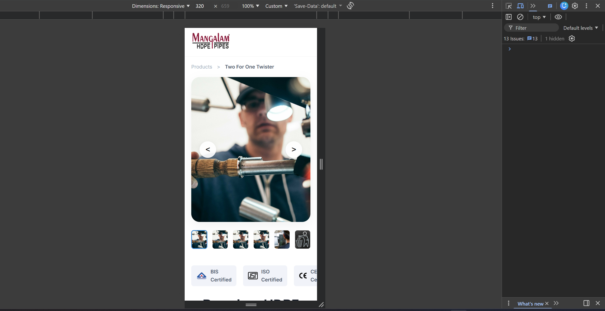

# HDPE Pipes Product Page – Frontend Assignment

This project is a **responsive product landing page** built using **vanilla HTML, CSS, and JavaScript**. The page follows the provided **Figma design specifications** and implements interactive UI features such as a **sticky header**, **image carousel with zoom functionality**, and **fully responsive layout**.

The implementation focuses on **clean code, semantic HTML, modern CSS practices, and performance optimization** while ensuring cross-browser compatibility.

## Live Link

[https://gushwork-assignment-lyart.vercel.app/](https://gushwork-assignment-lyart.vercel.app/)

## Screenshots





# Figma Design Reference

Design was implemented based on the following Figma file:

[https://www.figma.com/design/DOv07H7C2tA5UrVLhmfwfW/Gushwork-Assignment?node-id=490-8785](https://www.figma.com/design/DOv07H7C2tA5UrVLhmfwfW/Gushwork-Assignment?node-id=490-8785)

The goal was to achieve **pixel-perfect alignment with the design specifications**, including layout, spacing, typography, and interactions.


# Features Implemented

## 1. Responsive Layout

The webpage is fully responsive and adapts to different screen sizes:

* Desktop
* Tablet
* Mobile devices

Modern CSS techniques such as **Flexbox and CSS Grid** were used to create a fluid layout.


## 2. Sticky Header Functionality

The page includes a **dynamic sticky header** with the following behavior:

* The header appears **after scrolling beyond the first fold**
* It positions **above the navigation bar**
* It hides again when scrolling back to the top
* Smooth transition animations are implemented using CSS and JavaScript

This improves navigation accessibility for users browsing long pages.


## 3. Image Carousel

An interactive **image carousel** is implemented in the hero section:

Features include:

* Previous and next navigation buttons
* Thumbnail image navigation
* Smooth transitions between images
* Responsive resizing for mobile screens


## 4. Image Zoom on Hover

When hovering over the main product image:

* A **zoom lens effect** appears
* A **zoomed preview** is displayed
* The zoom area dynamically follows the cursor
* The functionality is implemented using pure **JavaScript and CSS**


## 5. Interactive UI Elements

Additional interactive elements include:

* FAQ accordion section
* Industry application carousel
* Manufacturing process tabs
* Modal forms for brochure download and callback request
* Form validation for contact inputs


# Tech Stack

This project uses **pure frontend technologies** without any frameworks or libraries.

* HTML5 (Semantic structure)
* CSS3 (Flexbox, Grid, animations)
* Vanilla JavaScript (ES6)

No external frameworks such as React, Vue, Bootstrap, or jQuery were used.


# Project Structure

```
project-folder/
│
├── index.html        # Main HTML file
├── styles.css        # Stylesheet containing all layout and responsive styles
├── script.js         # JavaScript for interactive components
│
├── assets/
│   ├── logo.png
│   ├── certs/
│   ├── section/
│   ├── testimonial.png
│   └── other images
│
└── README.md
```


# Key Implementation Details

## Semantic HTML

The layout uses semantic HTML elements such as:

* `header`
* `nav`
* `section`
* `footer`
* `main`

This improves **accessibility and SEO**.


## Modern CSS Practices

The styling follows modern CSS principles:

* Flexbox for layout alignment
* CSS Grid for structured sections
* Responsive media queries
* Smooth hover transitions
* Reusable utility classes


## JavaScript Functionality

JavaScript is used to implement:

* Sticky header behavior
* Image carousel navigation
* Image zoom functionality
* FAQ accordion toggle
* Modal open and close actions
* Form submission handling

The code is written in **modular and readable format with comments explaining key logic**.


# How to Run the Project

1. Download or clone the repository.

```
git clone https://github.com/your-username/gushwork-assignment.git
```

2. Navigate to the project folder.

3. Open `index.html` in any modern browser.

No build tools or installations are required.


# Browser Compatibility

The page has been tested in modern browsers including:

* Google Chrome
* Microsoft Edge
* Mozilla Firefox
* Safari


# Performance Considerations

The implementation focuses on performance by:

* Using optimized images
* Avoiding heavy frameworks
* Writing minimal and efficient JavaScript
* Reducing unnecessary DOM manipulations


# Accessibility

Accessibility best practices followed include:

* Alt attributes for images
* Semantic HTML structure
* Proper input labels and placeholders
* Keyboard-friendly form inputs


# Author

Anchit Julaniya
Full Stack MERN Developer

Email: [AnchitJulaniyaOfficial@gmail.com](mailto:AnchitJulaniyaOfficial@gmail.com)


# Submission Notes

This assignment demonstrates:

* Pixel-accurate UI implementation
* Interactive JavaScript functionality
* Responsive design principles
* Clean and maintainable frontend code

All requirements from the assignment brief have been implemented using **vanilla HTML, CSS, and JavaScript**.
